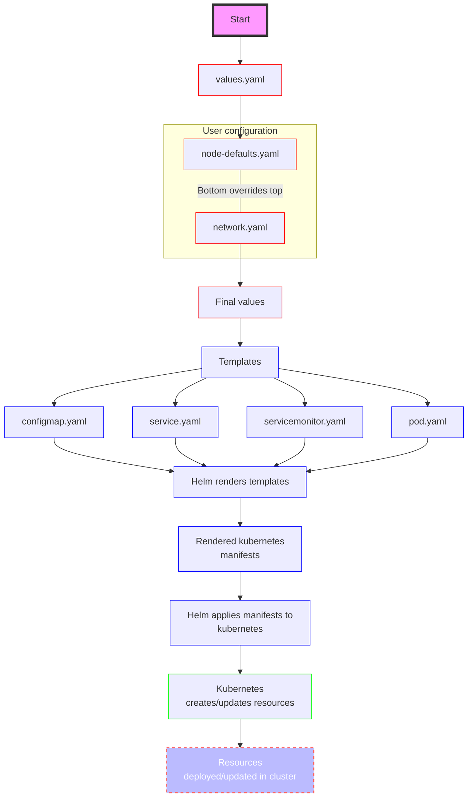

# Configuration value propagation

This flowchart illustrates the process of how values for the Bitcoin Core module are handled and deployed using Helm in a Kubernetes environment.

The process is similar for other modules (e.g. fork-observer), but may differ slightly in filenames.

- The process starts with the `values.yaml` file, which contains default values for the Helm chart.
- There's a decision point to check if user-provided values are available.
  These are found in the following files:
    - For config applied to all nodes: `<network_name>/node-defaults.yaml`
    - For network and per-node config: `<network_name>/network.yaml`

> [!TIP]
> `values.yaml` can be overridden by `node-defaults.yaml` which can be overridden in turn by `network.yaml`.

- If user-provided values exist, they override the defaults from `values.yaml`. If not, the default values are used.
- The resulting set of values (either default or overridden) becomes the final set of values used for deployment.
- These final values are then passed to the Helm templates.
- The templates (`configmap.yaml`, `service.yaml`, `servicemonitor.yaml`, and `pod.yaml`) use these values to generate the Kubernetes resource definitions.
- Helm renders these templates, substituting the values into the appropriate places.
- The rendering process produces the final Kubernetes manifest files.
- Helm then applies these rendered manifests to the Kubernetes cluster.
- Kubernetes processes these manifests and creates or updates the corresponding resources in the cluster.
- The process ends with the resources being deployed or updated in the Kubernetes cluster.

In the flowchart below, boxes with a red outline represent default or user-supplied configuration files, blue signifies files operated on by Helm or Helm operations, and green by Kubernetes.

Users should only concern themselves therefore with setting configuration in the `<network_name>/[network|node-defaults].yaml` files.
