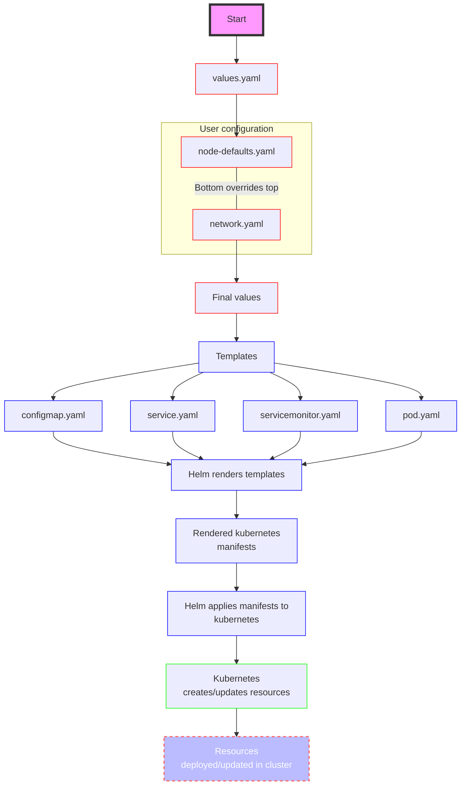

# Configuration value propagation

This flowchart illustrates the process of how values for the Bitcoin Core module are handled and deployed using Helm in a Kubernetes environment.

The process is similar for other modules (e.g. fork-observer), but may differ slightly in filenames.

- The process starts with the `values.yaml` file, which contains default values for the Helm chart.
- There's a decision point to check if user-provided values are available.
  These are found in the following files:
    - For config applied to all nodes: `<network_name>/node-defaults.yaml`
    - For network and per-node config: `<network_name>/network.yaml`

> [!TIP]
> `values.yaml` can be overridden by `node-defaults.yaml` which can be overridden in turn by `network.yaml`.

- If user-provided values exist, they override the defaults from `values.yaml`. If not, the default values are used.
- The resulting set of values (either default or overridden) becomes the final set of values used for deployment.
- These final values are then passed to the Helm templates.
- The templates (`configmap.yaml`, `service.yaml`, `servicemonitor.yaml`, and `pod.yaml`) use these values to generate the Kubernetes resource definitions.
- Helm renders these templates, substituting the values into the appropriate places.
- The rendering process produces the final Kubernetes manifest files.
- Helm then applies these rendered manifests to the Kubernetes cluster.
- Kubernetes processes these manifests and creates or updates the corresponding resources in the cluster.
- The process ends with the resources being deployed or updated in the Kubernetes cluster.

In the flowchart below, boxes with a red outline represent default or user-supplied configuration files, blue signifies files operated on by Helm or Helm operations, and green by Kubernetes.


```mermaid
graph TD
    A[Start]:::start --> B[values.yaml]:::config
    subgraph User Configuration [User configuration]
        C[node-defaults.yaml]:::config
        D[network.yaml]:::config
    end
    B --> C
    C -- Bottom overrides top ---D
    D --> F[Final values]:::config
    F --> I[Templates]:::helm
    I --> J[configmap.yaml]:::helm
    I --> K[service.yaml]:::helm
    I --> L[servicemonitor.yaml]:::helm
    I --> M[pod.yaml]:::helm
    J --> N[Helm renders templates]:::helm
    K & L & M --> N
    N --> O[Rendered kubernetes
    manifests]:::helm
    O --> P[Helm applies manifests to 
    kubernetes]:::helm
    P --> Q["Kubernetes 
    creates/updates resources"]:::k8s
    Q --> R["Resources 
    deployed/updated in cluster"]:::finish

    classDef start fill:#f9f,stroke:#333,stroke-width:4px
    classDef finish fill:#bbf,stroke:#f66,stroke-width:2px,color:#fff,stroke-dasharray: 5 5
    classDef config stroke:#f00
    classDef k8s stroke:#0f0
    classDef helm stroke:#00f
```

Users should only concern themselves therefore with setting configuration in the `<network_name>/[network|node-defaults].yaml` files.

## Network file reference

The top-level keys recognised in `network.yaml` are:

| Key | Description |
|-----|-------------|
| `nodes:` | List of node definitions (see below) |
| `caddy:` | `enabled: true` to deploy the Caddy reverse-proxy dashboard |
| `fork_observer:` | `enabled: true` to deploy Fork Observer |
| `services:` | Extra services to register on the Caddy dashboard (see below) |
| `plugins:` | Plugin hooks (`preDeploy`, `postDeploy`, `preNode`, `postNode`, `preNetwork`, `postNetwork`) |
| `warnet:` | Deployment label/identifier string (e.g. `"my_network"`) |

### `services:` — extra dashboard entries

Any additional web services running inside the cluster (e.g. a Lightning-network visualiser) can be surfaced on the Caddy dashboard alongside the built-in Grafana and Fork Observer entries:

```yaml
services:
  - title: LN Visualizer Web UI
    path: /lnvisualizer/
    host: lnvisualizer.default
    port: 80
```

Each entry supports the following fields:

| Field | Description |
|-------|-------------|
| `title` | Display name shown on the dashboard landing page |
| `path` | URL path prefix that Caddy will proxy to this service |
| `host` | Kubernetes service hostname (use the `.default` suffix for cluster-internal hostnames) |
| `port` | Port the service listens on |

## Node configuration reference

Each entry in the `nodes:` list is a Bitcoin Core tank. To add a Lightning node to a tank, two sibling keys work together: `ln:` enables the implementation, and `lnd:` or `cln:` holds its configuration.

### Adding a Lightning node

Enable LND or CLN with the `ln:` key, then configure it with a matching sibling key at the same level:

```yaml
nodes:
  - name: tank-0000
    ln:
      lnd: true     # enable LND — use cln: true for Core Lightning instead
    lnd:            # LND configuration (sibling of ln:, not nested inside it)
      config: |
        color=#3399FF
      channels:
        - id:
            block: 500
            index: 1
          target: tank-0001-ln
          capacity: 1000000
```

The `ln:` key is the on/off switch. The `lnd:` (or `cln:`) key is the configuration object. They are always at the same indentation level inside the node entry — `lnd:` is **not** nested inside `ln:`.

Only one implementation may be active per node:

| To enable | Set | Then configure with |
|-----------|-----|---------------------|
| LND | `ln.lnd: true` | `lnd:` sibling key |
| Core Lightning | `ln.cln: true` | `cln:` sibling key |

See [LN Options](ln-options.md) for the full reference of everything that goes under `lnd:` and `cln:`.

---

The remaining keys in this section apply to the Bitcoin Core container itself.

### `global:` — chain and RPC password shorthand

Sets `chain` and `rpcpassword` at the node level. These values are propagated into the Helm chart's `global` sub-object, which is also shared with LND sub-charts:

```yaml
nodes:
  - name: tank-0000
    global:
      chain: signet
      rpcpassword: mysecretpassword
```

Without `global.chain`, the default is `regtest`.

### `resources:` — Kubernetes resource limits

Standard Kubernetes [resource requests and limits](https://kubernetes.io/docs/concepts/configuration/manage-resources-containers/) for the Bitcoin Core container:

```yaml
nodes:
  - name: tank-0000
    resources:
      limits:
        cpu: 4000m
        memory: 1000Mi
      requests:
        cpu: 100m
        memory: 200Mi
```

### `startupProbe:` — startup probe override

Override the default Kubernetes startup probe for a node. Useful when a node requires custom initialisation before it is considered ready (e.g. importing a wallet or descriptor on first boot):

```yaml
nodes:
  - name: miner
    startupProbe:
      exec:
        command:
          - /bin/sh
          - -c
          - bitcoin-cli createwallet miner
      failureThreshold: 10
      periodSeconds: 30
      successThreshold: 1
      timeoutSeconds: 60
```

### `restartPolicy:` — pod restart policy

Sets the Kubernetes [restart policy](https://kubernetes.io/docs/concepts/workloads/pods/pod-lifecycle/#restart-policy) for the node pod. Defaults to `Never` for Bitcoin Core nodes and `Always` for LND nodes.

```yaml
nodes:
  - name: tank-0000
    restartPolicy: Never
```

### `collectLogs:` and `metricsExport:`

See [Logging and Monitoring](logging_monitoring.md) for details on enabling log collection and Prometheus metrics export per node.

### `extraContainers:` — sidecar containers

Add arbitrary sidecar containers to the Bitcoin Core pod. This is the same mechanism used to attach the `bitcoin-exporter` Prometheus sidecar. Each entry is a full Kubernetes container spec:

```yaml
nodes:
  - name: tank-0000
    extraContainers:
      - name: my-sidecar
        image: myrepo/my-sidecar:latest
        ports:
          - containerPort: 8080
            name: web
            protocol: TCP
```

## Lightning node configuration reference

For the full reference of all `lnd:` and `cln:` configuration keys — including `channels`, `macaroonRootKey`, `adminMacaroon`, `resources`, `restartPolicy`, `persistence`, `metricsExport`, `extraContainers`, `circuitbreaker`, and more — see [LN Options](ln-options.md).

## `node-defaults.yaml` reference

The `node-defaults.yaml` file accepts the same node-level keys as `network.yaml` and applies them as defaults to every node. It additionally supports:

### `warnet:` — deployment label

A string identifier for the deployment, used as a label on Kubernetes resources:

```yaml
warnet: my_signet_network
```
