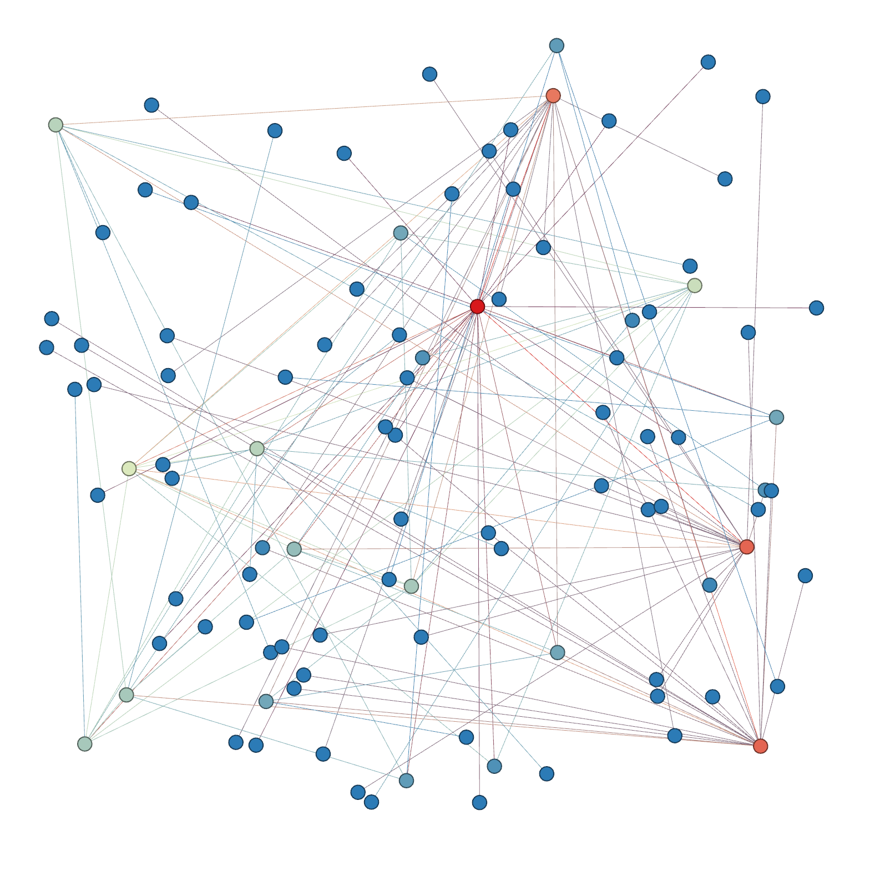

# Warnet Network Topology

Warnet creates a Bitcoin network using a network topology from a [graphml](https://graphml.graphdrawing.org/specification.html) file.

Before any scenarios or RPC commands can be executed, a Warnet network must be started from a graph.
See [warcli.md](warcli.md) for more details on these commands.

To start a network called `"warnet"` from the [default graph file](../src/graphs/default.graphml)
which consists of 12 Bitcoin Core v26.0 nodes connected in a ring:
```
warcli network start
```

To start a network with custom configurations:
```
warcli network start <path/to/file.graphml> --network="network_name"
```

## GraphML file specification

```graphml
<?xml version="1.0" encoding="UTF-8"?><graphml xmlns="http://graphml.graphdrawing.org/xmlns">
<key attr.name="label" attr.type="string" for="node" id="label"/>
<key attr.name="x" attr.type="float" for="node" id="x"/>
<key attr.name="y" attr.type="float" for="node" id="y"/>
<key attr.name="version" attr.type="string" for="node" id="version"/>
<key attr.name="bitcoin_config" attr.type="string" for="node" id="bitcoin_config"/>
<key attr.name="tc_netem" attr.type="string" for="node" id="tc_netem"/>
<graph edgedefault="directed">

<!-- <nodes> -->
<!-- <edges> -->

</graph>
</graphml>

```
### Node attributes

* `id` should be a unique integer identifier
* `label` [optional] specifies the node's label
* `x` specifies the node's x position when rendered in a GUI
* `y` specifies the node's y position when rendered in a GUI
* `version` specifies the node's Bitcoin Core release version, or GitHub branch
* `bitcoin_config` is a comma-separated list of values the node should apply to it's bitcoin.conf, using bitcoin.conf syntax
* `tc_netem` is a `tc-netem` command as a string beginning with "tc qdisc add dev eth0 root netem"

`version` should be either a version number from the pre-compiled binary list on https://bitcoincore.org/bin/ **or** a branch to be compiled from GitHub using `<user>/<repo>#<branch>` syntax.

Nodes can be added to the graph as follows:


#### Release binaries

```graphml
<node id="0">
<data key="x">5.5</data>
<data key="y">2.5</data>
<data key="version">26.0</data>
<data key="bitcoin_config">uacomment=warnet0_v24,debugexclude=libevent</data>
<data key="tc_netem"></data>
</node>
```
#### Pre-built custom image

For a pre-built custom image, remove the `version` tag, and add the image repository to an `image` tag.
These should be built using the `warcli image build` command to ensure they have the needed patches.

```graphml
<node id="0">
<data key="x">5.5</data>
<data key="y">2.5</data>
<data key="image">bitcoindevproject/bitcoin:26.0</data>
<data key="bitcoin_config">uacomment=warnet0_v24,debugexclude=libevent</data>
<data key="tc_netem"></data>
</node>
```

#### On-demand built branch

For an on-demand built branch with traffic shaping rules applied using `tc_netem`:

```graphml
<node id="0">
<data key="x">2.5</data>
<data key="y">5.0</data>
<data key="version">vasild/bitcoin#relay_tx_to_priv_nets</data>
<data key="bitcoin_config">uacomment=warnet1_custom,debug=1</data>
<data key="tc_netem">tc qdisc add dev eth0 root netem delay 100ms</data>
</node>
```

`x`, `y`, `version`, `bitcoin_config` and `tc_netem` data fields are optional for all nodes.

### Edges

Edges can be added between the nodes as follows:

```graphml
<edge id="0" source="0" target="1">
</edge>
```

## Creating graphs

Graphs can be created via the graph menu:

```bash
# show graph commands
warcli graph --help

# Create an erdos renyi graph of 12 nodes using edge connection probability of 0.3 and default bitcoin version (v26.0)
warcli graph create n=12 p=0.3 --outfile=erdos-renyi_n12_v26.0.graphml

# Create an erdos renyi graph of 15 nodes using default edge connection probability of p=0.2 and using random bitcoin versions
warcli graph create n=15 --outfile=erdos-renyi_n15_random.graphml --random
```

## Examples

1. [example.graphml](../src/graphs/default.graphml) -- This is the default graph.
2. [random_internet_as_graph_n100_pos.graphml](../src/graphs/random_internet_as_graph_n100_pos.graphml)


*random_internet_as_graph_n100*
