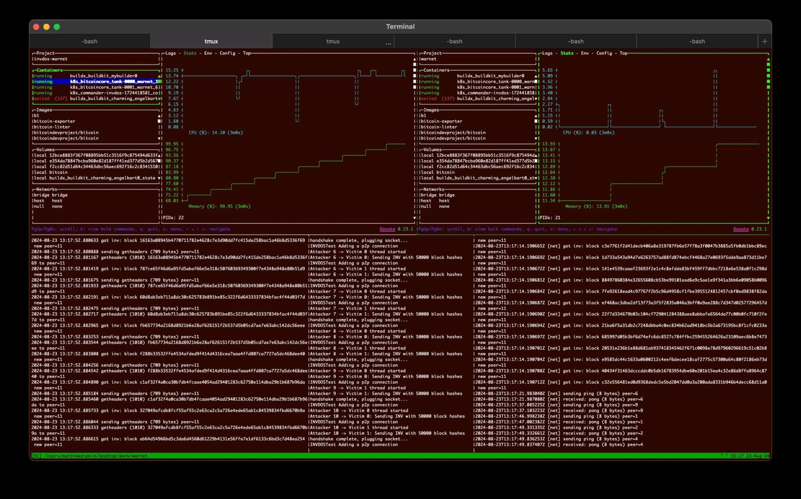

# Running a warnet scenario

Warnet allows a bitcoin network topology and scenario steps to be defined in code. This document will use an existing scenario that demonstrates an inventory denial-of-service attack ([Inv DOS](https://invdos.net/)) on Bitcoin Core 16.1. This particular vulnerability was patched in 16.2 and later. Warnet scenarios can be any conceivable network toplogy and series of steps; they aren't just useful for demonstrating vulnerabilities but could be used to demonstrate new functionality instead.

## Clone example scenario

```shell
git clone https://github.com/pinheadmz/invdos-warnet
cd invdos-warnet
```

## Install Dependencies

Warnet requires a k8s cluster and configured kubectl executable to run against. Please see [installing dependencies](https://github.com/bitcoin-dev-project/warnet/blob/main/docs/install.md#dependencies) for instructions how to install this locally. Two popular choices for local clusters are Minikube and Docker Desktop's Kubernetes.

## Install warnet

```shell
python3 -m venv .venv
source .venv/bin/activate
pip install warnet
# check warnet works
# should print list of warnet commands
warnet
```

## Set namespace

Warnet will install the bitcoin (and lightning) nodes in whichever namespace `kubectl` is configured with. For the purpose of this scenario we will switch to a namespace called `warnet`. This step is optional.

```shell
kubectl config set-context --current --namespace=warnet
```

## Start network

```shell
warnet deploy ./networks/1_node_0.16.1
# check nodes are running
warnet status
╭─────────────── Warnet Overview ───────────────╮
│                                               │
│                 Warnet Status                 │
│ ┏━━━━━━━━━━━┳━━━━━━━━━━━━━━━━━━━━━┳━━━━━━━━━┓ │
│ ┃ Component ┃ Name                ┃ Status  ┃ │
│ ┡━━━━━━━━━━━╇━━━━━━━━━━━━━━━━━━━━━╇━━━━━━━━━┩ │
│ │ Tank      │ tank-0000           │ running │ │
│ │ Tank      │ tank-0001           │ running │ │
│ │ Scenario  │ No active scenarios │         │ │
│ └───────────┴─────────────────────┴─────────┘ │
│                                               │
╰───────────────────────────────────────────────╯

Total Tanks: 2 | Active Scenarios: 0
```

## Run scenario

```shell
warnet run scenarios/invdos.py
# check scenario is running
warnet status
╭─────────────────── Warnet Overview ───────────────────╮
│                                                       │
│                     Warnet Status                     │
│ ┏━━━━━━━━━━━┳━━━━━━━━━━━━━━━━━━━━━━━━━━━━━┳━━━━━━━━━┓ │
│ ┃ Component ┃ Name                        ┃ Status  ┃ │
│ ┡━━━━━━━━━━━╇━━━━━━━━━━━━━━━━━━━━━━━━━━━━━╇━━━━━━━━━┩ │
│ │ Tank      │ tank-0000                   │ running │ │
│ │ Tank      │ tank-0001                   │ running │ │
│ │           │                             │         │ │
│ │ Scenario  │ commander-invdos-1725913984 │ running │ │
│ └───────────┴─────────────────────────────┴─────────┘ │
│                                                       │
╰───────────────────────────────────────────────────────╯

Total Tanks: 2 | Active Scenarios: 1
```

## Watch vulnerable node get taken down

We could just keep running `warnet status` and wait for the nodes to be taken down or we can use lazydocker TUI to watch the memory usage increase until the node dies

```shell
apt/brew install lazydocker
lazydocker
# select tank-0000 or tank-0001
# use ] key to show stats
```

